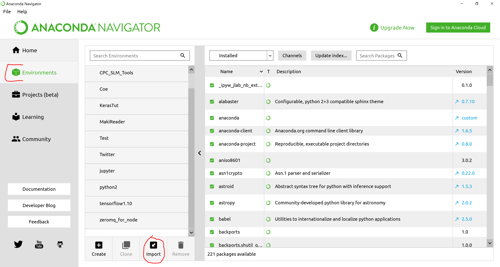
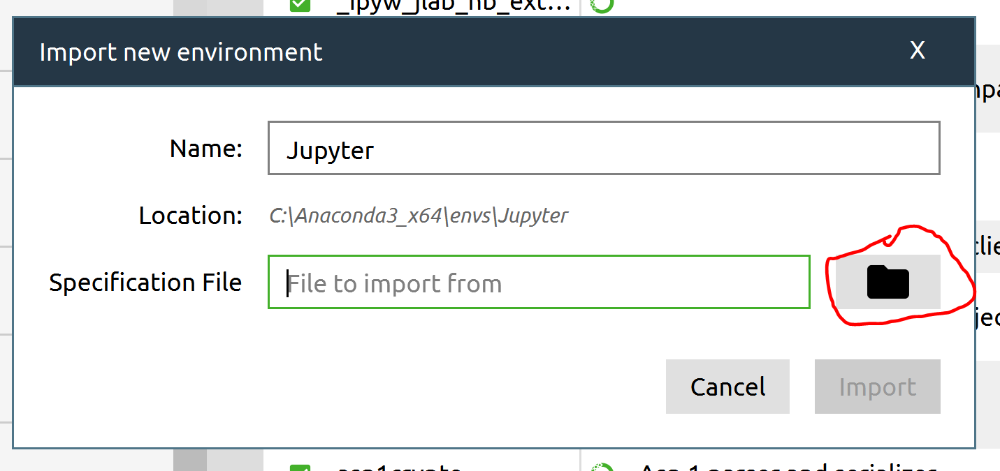
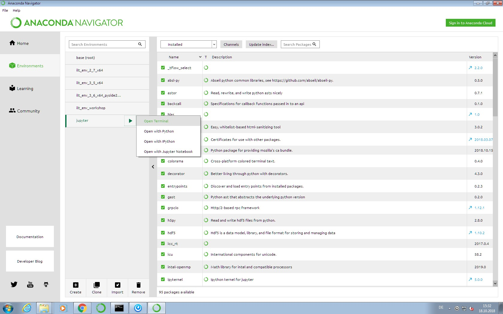
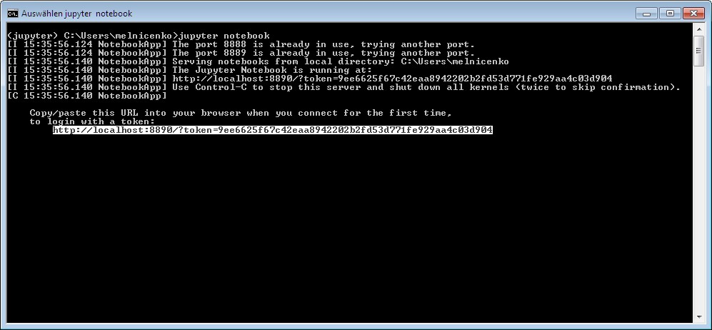

# Microtraining for Tensorflow and Keras

## Installation

* Install [Anconda](https://www.anaconda.com/download/)
* Download this Folder und unzip it. [Download Link](https://github.com/Smokrow/Microtraining/archive/master.zip)
Alternative: In case you have ***GIT*** installed use:
 `git clone https://github.com/Smokrow/Microtraining.git`

## Easy Startup for Windows
* run ***install.bat*** from the downloaded folder.This will create a new python environment ***jupyter*** and download all requiered packages.
* run ***start_notebook.bat*** from the downloaded folder. A jupyter notebook instance will start up and you will see the downloaded folder in your webbrowser
* Select the ***Microtraining.ipynb*** file in your webbrowser

## Manual Startup

* Start the Anaconda Navigator

* Go to the ***Enviroment*** tab and click ***Import***

* Name your environment ***jupyter*** and select the ***environment.yml*** file of this folder

* Wait until all packages have been downloaded
* Open the terminal of your environment

* Navigate the terminal to your
* Start you Jupyter notebook by typing `jupyter notebook` and press enter
* Your webbrowser should start up automatically. In case it does not follow the link provided by the terminal

* Navigate the unzipped folder and select ***Microtraining.ipynb***

## Jupyter Shortcuts
* Execute current cell:
`CTRL + Enter`
